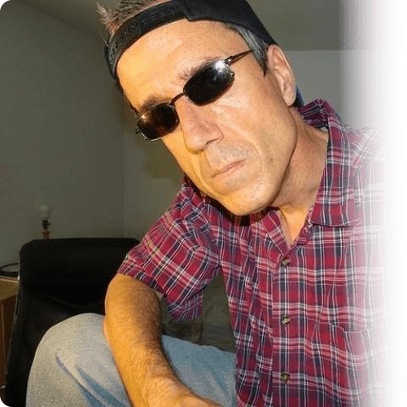
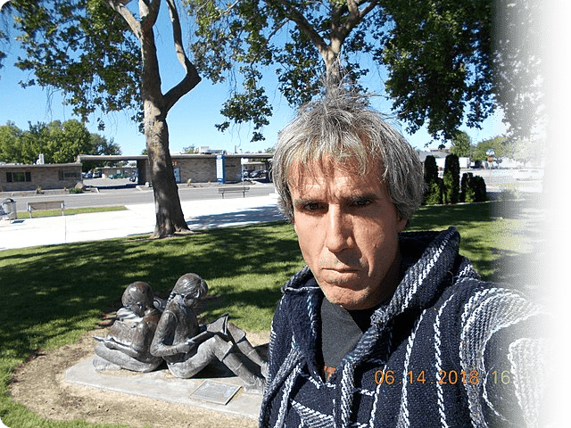

<h1><samp>A tribute to Terry Davis</samp></h1>

    <samp>
          
    <strong>"So, well, it's good to be King."</strong>
      
    ― Terry A. Davis, on his last video on YouTube, 
    hours before his tragic death
          
    </samp>

 

<h2><samp>Who is Terry Davis?</samp></h2>

<h2><samp>His early life</samp></h2>

     
<samp>
    <strong>
    Terry A.Davis, short for Terrence Andrew Davis, was born and raised in a Catholic family
    in West Allis, Wisconsin, USA. He moved on to Washington, Michigan, California and Arizona.
    He was born as the seventh of eight children. He learned computer engineering and electrical engineering in the Arizona State University. He also worked at Ticketmaster, programming CISC machines.
    </strong>
      
    The picture on the left is Terry with his Commodore 64.
     This later influences TempleOS greatly.
     He learned Assembly with it, and there started the career of the greatest programmer who ever existed.
</samp>

   

<h2><samp>The start of his mental illness</samp></h2>

       
<samp>
    <strong>
    As mentioned before, Terry was raised as a Catholic, but spent some years as an atheist.
    In 1996, Terry had to be in a mental asylum for his manic episodes occuring once in a while.
    he claimed that he saw CIA agents and aliens. He started donating large sums of money to charity organizations,
    something he had never done before. Later, he referred to this as 
    "The act that probably caused God to reveal Himself to me and save me".
    </strong>
</samp>

     

<h2><samp>TempleOS, the start of a legend</samp></h2>

   
<samp>
    <strong>
    TempleOS, which was known as the "J Operating System" from 2004 to 2005, "LoseThos" from 2006 to early 2012, and "SparrowOS" in late 2012 is an operating system similar to the Commodore 64 and other DOS-like interfaces. It was developed over the period of more than a decade, and <i>everything</i> was written from scratch.
    </strong>
</samp>

   

   
<samp>
    <strong>
    The UI is very primitive, but has a full-blown window manager. Everything in the OS is written with HolyC, a dialect of C which improves
    the C syntax greatly. HolyC is JIT-compiled, and can also be ahead-of-time compiled. Also TempleOS uses a filesystem called RedseaFS, a new FAT32 filesystem with absolute block addresses. The best thing about TempleOS is that you could embed graphics in plain text, and that's something you can see nowhere else.
    </strong>
</samp>

    

<h2><samp>Terry's online works</samp></h2>

 
<samp>
    <strong>
    In the early 2010s, Terry started to make videos and stream live, teaching people about HolyC, TempleOS, and doing things a streamer does nowdays.
    His schizophrenia affected his speech, and his online comments were usually incomprehensible. However, there are also very happy moments cought on camera.
    He always referred to himself as the greatest programmer that ever lived. People began to follow him and he earned a reputation as a schizophrenic on Twitch.
    He was controversial for his racist and homophobic speech, but it's because he reinvented some English words due to his schizophrenia. He didn't really mean it.
    </strong>
</samp>

    

   
<samp>
    <strong>
    He made many videos about TempleOS. He was always very sharp when talking about TempleOS, and documented his code better than almost any other developer
    one the internet, despite his schizophrenia. He always made hour-long videos on fixing bugs and writing HolyC and Assembly on his van, while running away from
    the CIA. he was very excited and happy during these days.
    </strong>
</samp>

   

<h2><samp>His last days, and the rise to throne</samp></h2>

 
<samp>
    <strong>
    Terry spent the last days of his life as a homeless, after being incarcenated many times. In his final video, recorded on a bench and uploaded hours before his death, he explained that he had removed most of his videos because he did not wish to litter the Internet, and that he had learned how to purify himself. In the final seconds of his video, he calls himself a King. This was probably the implication of his death. On the evening of August 11, 2018, Davis was struck and killed by a train while walking alongside railroad tracks.
    </strong>
</samp>

    

<h2><samp>What makes him so special?</samp></h2>

   
<samp>
    <strong>
    Terry was a schizophrenic and had mental disorders which made his life very hard. You could think he was just a pathetic schizophrenic
    who had a passion of touching computers, but he was actually <i>much</i> more than that. He wrote a complete operating system from scratch, 
    made his programming language which actually <i>works</i>, and documented his code well. He also had a very happy, humble mind, saying that "we always
    just try our best, and maybe that's the best we could do". Writing TempleOS is like building a rocket that's ugly but actually flies into space.
    He would have been much more influencial and well-known, like Linus Torvalds, if it wasn't for his illness.
    </strong>
</samp>

   

<h2><samp>Quotes</samp></h2>

    
<strong><samp>「</samp></strong>

     <samp><strong>
    What’s reality? I don’t know. 
    When my bird was looking at my computer monitor I thought, ‘Woah, that bird has no idea what he’s looking at.’ 
    And yet what does the bird do? Does he panic? 
    No, he can’t really panic, he just does the best he can. 
    Is he able to live in a world where he’s so ignorant? 
    Well, he doesn’t really have a choice. 
    The bird is okay even though he doesn’t understand the world. 
    You’re that bird looking at the monitor, and you’re thinking to yourself, ‘I can figure this out.’ 
    Maybe you have some bird ideas. Maybe that’s the best you can do. </strong>
     </samp>
    
<strong><samp>」</samp></strong>

    
<strong><samp>「</samp></strong>

     <samp><strong>
    I live in kind of an old environment. 
    I just...I go to dentists and doctors, my parents go to dentists and doctors. 
    That's all we do. We watch TV, they go to the casino. 
    I've been fighting...to bring it to fruition. But I'm in some kind of prison or something. 
    So basically now I just kinda kill time. 
    But I'm God's High Priest, so there's nothing better to do with your time than kill time with Mr. God and enjoy divine intellect all day long. </strong>
     </samp>
    
<strong><samp>」</samp></strong>

    
<strong><samp>「</samp></strong>

     <samp><strong>
    I think teeth are the first reminder of mortality. 
    I think that's where it begins to hit you. 
    Because they don't come back and that's it. </strong>
     </samp>
    
<strong><samp>」</samp></strong>

    
<strong><samp>「</samp></strong>

     <samp><strong>
    Jesus said "I will rebuild this Temple in 3 days." 
    I could make a compiler in 3 days. </strong>
     </samp>
    
<strong><samp>」</samp></strong>

    
<strong><samp>「</samp></strong>

     <samp><strong>
    God is all around us, it is our job to seek him out. </strong>
     </samp>
    
<strong><samp>」</samp></strong>

  

<h3><samp><strong>Rest in peace, Terry. You are a gem of a developer and will be remembered forever. RIP Terry Davis(1969.12.15~2018.8.11)</strong></samp></h3>

    

<h2><samp>License</samp></h2>

<samp>
    <strong>
    This tribute is a part of the public domain, just like TempleOS.
    </strong>
</samp>
